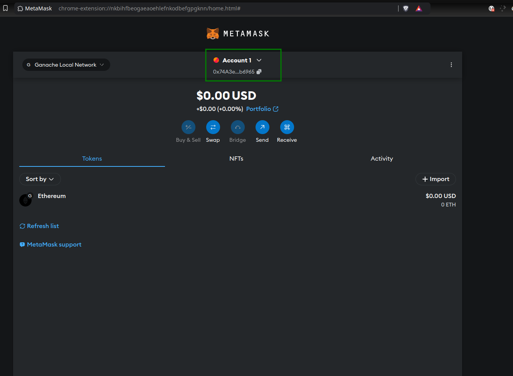
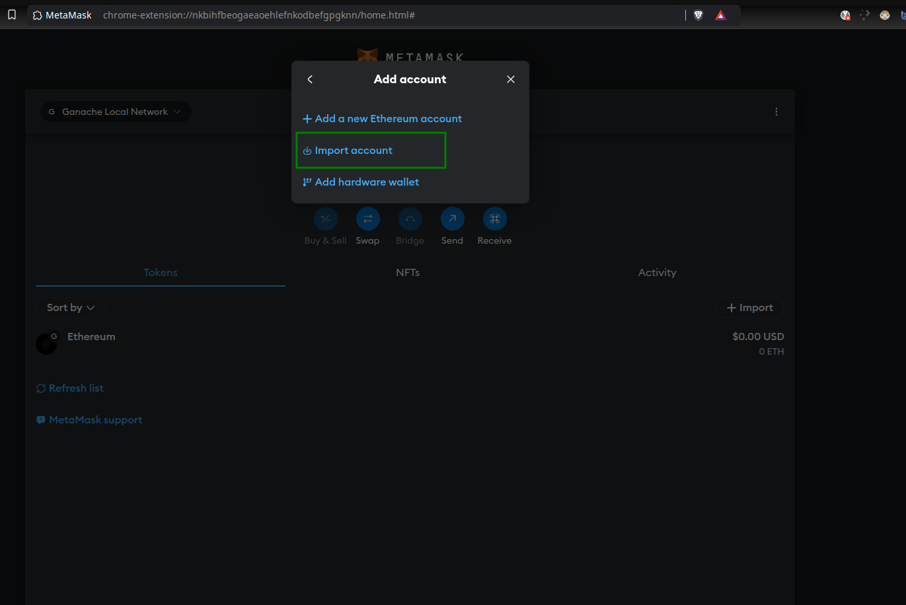
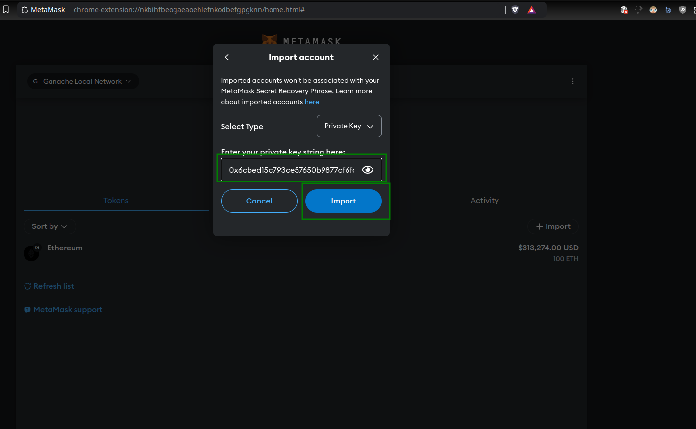

# Ethereum Test RPC with Ganache CLI in Docker

This guide shows you how to set up an Ethereum test RPC using Ganache CLI with Docker. Ganache is a personal Ethereum blockchain used for development, and Docker allows you to run it in an isolated environment.

## Prerequisites

Before starting, make sure you have the following installed:

- [Docker](https://docs.docker.com/get-docker/)
- [Docker Compose](https://docs.docker.com/compose/install/)

---

### Step 1: Clone the project

```bash
git clone https://github.com/shaban00/ethereum-test-rpc.git
```

```bash
cd ethereum-test-rpc
```

### Step 2: Start the Ganache Container

1. Start the Docker Containers

```bash
docker compose up -d
```

2. Check the Running Containers

```bash
docker ps
```

This should list your `ganache-cli` container, running and exposing port `8545`.

### Step 3: Access Ganache RPC

Once Ganache is running, you can interact with the Ethereum test network via its JSON-RPC endpoint.

- RPC URL: `http://localhost:8545`
- Chain ID: `1337`

View the Generated Accounts

```bash
docker logs ganache-cli
```

You should see something like this:

```markdown
Ganache CLI v6.12.2 (ganache-core: 2.13.2)

# Available Accounts

(0) 0x4d46b48f8... - 1000 ETH
(1) 0x8b6a5d839... - 1000 ETH
(2) 0x3c5bcb9d7... - 1000 ETH
```

These accounts are pre-funded with 1000 ETH each, which you can use for development and testing.

### Step 4: Interact with Ganache

You can now interact with the Ganache test network via any Ethereum-compatible tool or library. For example, using `web3.js`:

```javascript
const Web3 = require("web3");
const web3 = new Web3("http://localhost:8545");

// Get accounts
web3.eth.getAccounts().then(console.log);
```

### Step 5: Adding Ganache Test Network to MetaMask

To interact with your Ganache test RPC in MetaMask, you need to add a custom network in MetaMask that points to the local Ganache instance running in Docker.

1. Open Network Settings in MetaMask

   - Click on the network dropdown in the top center of the MetaMask extension (it will likely show `Ethereum Mainnet` by default).
   - Click on `Add a custom network` at the bottom of the network list.

2. Add a Custom RPC Network. In the Add Network screen, fill out the fields as follows:

   - Network Name: `Ganache Local Network` (or any name you prefer)
   - Default RPC URL: `http://localhost:8545`
   - Chain ID: `1337`
   - Currency symbol: `ETH`
   - Block Explorer URL: Leave this blank (optional)
   - Click `Save` to add the custom network.

3. Switch to the Ganache Network
   After saving, you will now be able to switch to the `Ganache Local Network` from the MetaMask network dropdown. Once you switch, MetaMask will use your local Ganache instance, and you can send transactions, interact with contracts, and more.

4. Import accounts into MetaMask
   To import accounts from Ganache into MetaMask:
   - In MetaMask, click on the `Account Icon` in the top right corner, and then click on `Add account or hardware wallet`.
   - Click on `Import account`
   - Copy the private key of any of the Ganache accounts from the Docker logs (`docker logs ganache-cli`)
   - Paste the private key into MetaMask to import it as a new account.

You should now have full access to your Ganache accounts within MetaMask.

### Tutorials










---

### Step 6: Stopping and Removing Containers

When you're done with your testing or development and want to stop the Ganache container, follow these steps:

1. Stop the Containers: To stop the containers without removing them, use:

```bash
docker compose down
```

This will stop the container, but the data will still be retained in the Docker volume.

2. Stop and Remove Containers, Volumes, and Networks

If you want to completely remove the containers, volumes, and networks (i.e., clean everything up), use:

```bash
docker compose down -v
```

The `-v` flag ensures that the Docker volumes (including the `ganache-data` volume) are removed.
